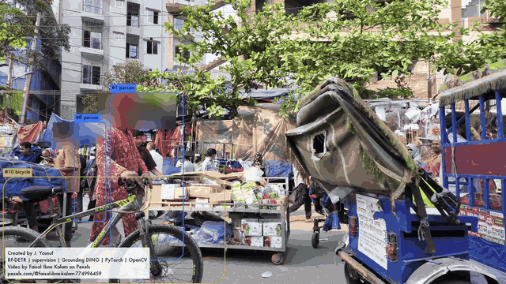
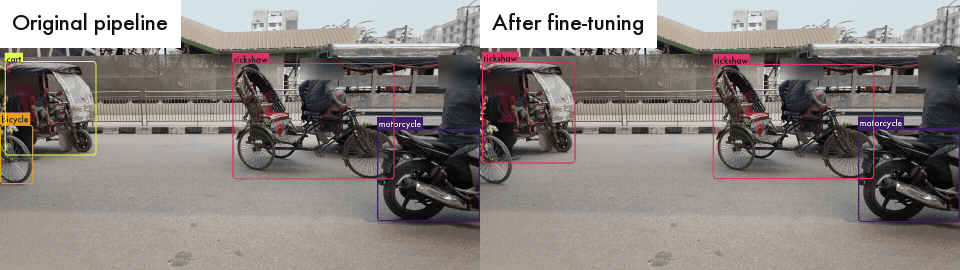
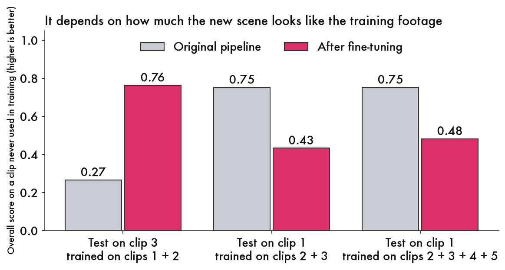
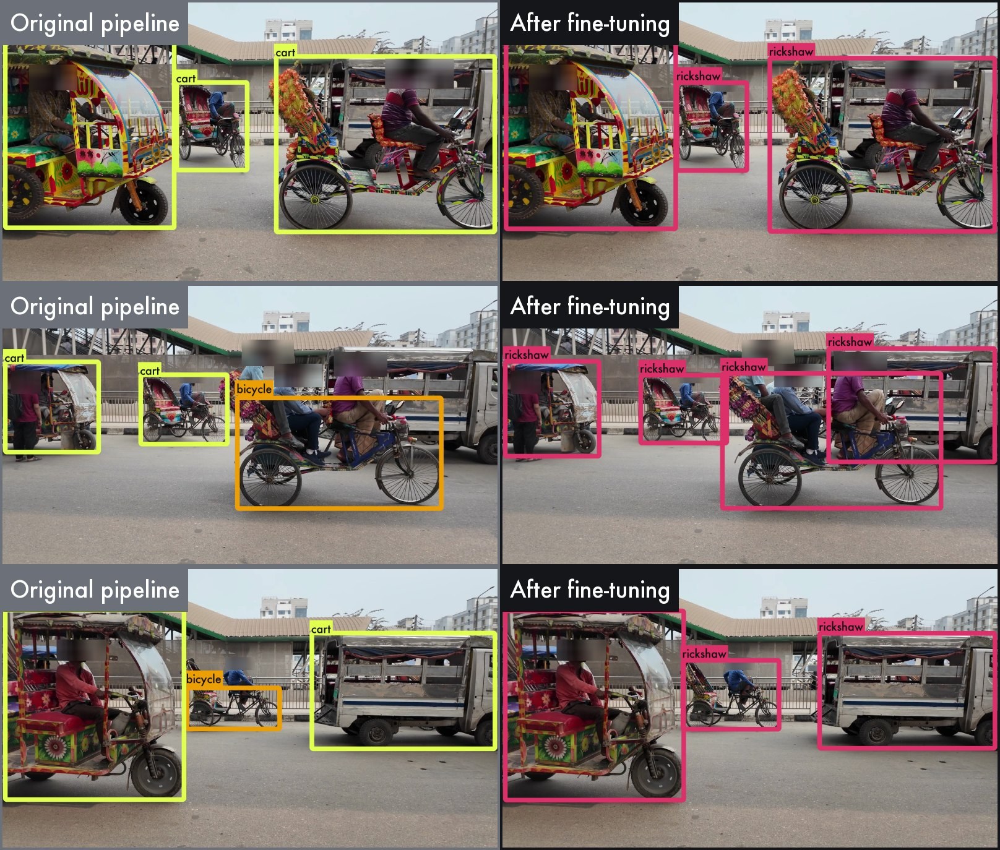
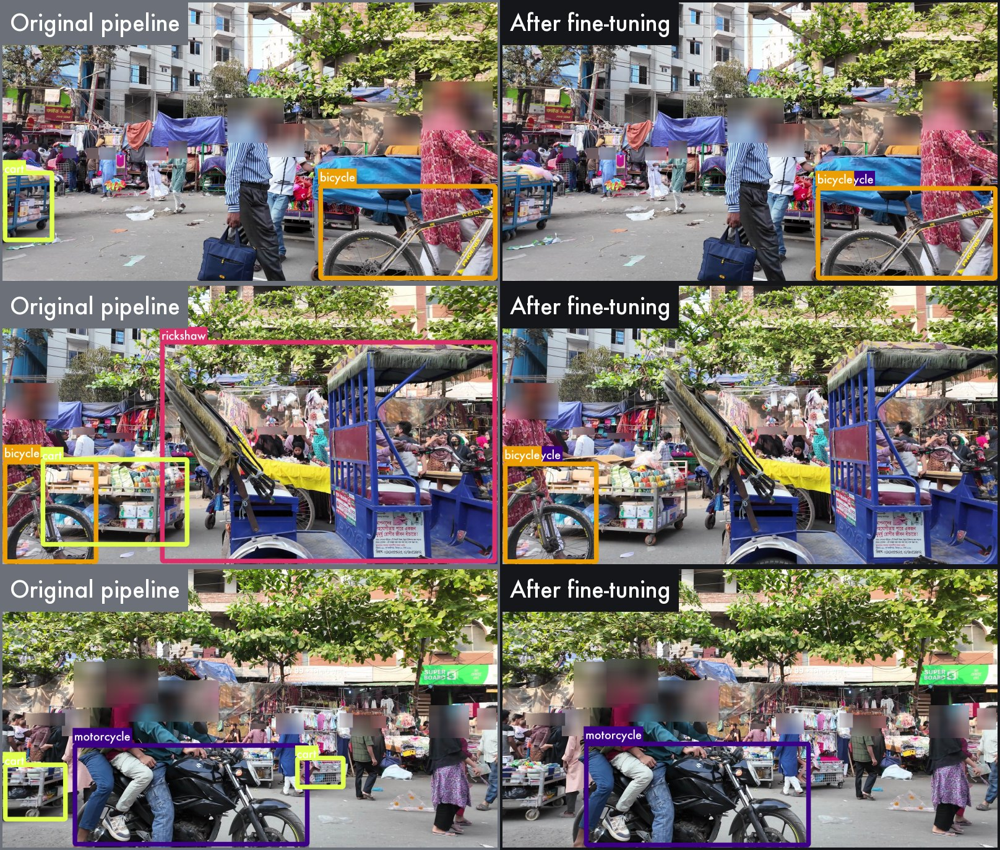
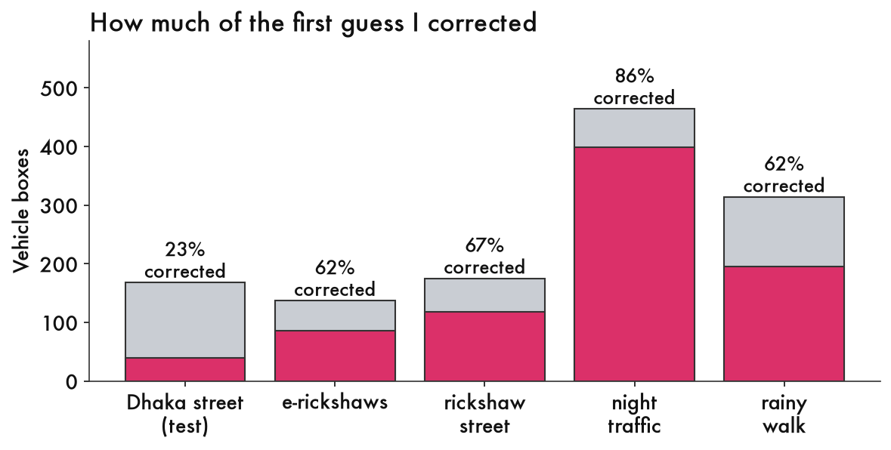

# programmable-dhaka

**Teaching RF-DETR to identify rickshaws in Dhaka street footage, with supervision.**

 Built with Claude Code, Sonnet 5.5



*The Dhaka street clip, which RF-DETR never trained on.*

 person&nbsp;&nbsp;·&nbsp;&nbsp; rickshaw&nbsp;&nbsp;·&nbsp;&nbsp; motorcycle&nbsp;&nbsp;·&nbsp;&nbsp; bicycle&nbsp;&nbsp;·&nbsp;&nbsp; cart

## Contents

- [Reasons to try Roboflow's open source tools](#reasons-to-try-roboflows-open-source-tools)
- [Why Dhaka](#why-dhaka)
- [What I learned](#what-i-learned)
- [Limits](#limits)
- [Product feedback](#product-feedback)
- [Questions I'd like to dig into](#questions-id-like-to-dig-into)
- [Scores, how to rerun it, and tips](#scores-how-to-rerun-it-and-tips)
- [Built with open source tools and Claude Code](#built-with-open-source-tools-and-claude-code)

## Reasons to try Roboflow's open source tools

**Plug and play.** All I needed to start was my laptop and free videos I downloaded.

| What I wanted | What I used | What happened |
|---|---|---|
| First labels without drawing every box | RF-DETR, which already knows everyday objects, and Grounding DINO, which finds things from a written description, for rickshaws and carts | I corrected the first guess instead of drawing every box: 23% of the boxes on the busy Dhaka street, and about two thirds on the clips that were mostly rickshaws |
| A name for something RF-DETR did not know | Fine-tuned RF-DETR (80 everyday objects, no word for rickshaw) on 141 pictures that show only about five different rickshaws | On a clip it never saw, it went from finding 44 of 179 rickshaws to 138, about 10 to 15 minutes of training on a laptop |
| A better model with another pass | The same loop: predict, correct, retrain | Adding one clear, fully labeled clip took rickshaw F1 on an unseen scene from 0.48 to 0.64 ([experiment log](docs/EXPERIMENT_LOG.md)) |
| Steady, readable video | supervision: tracking, box smoothing, blurring and drawing | Each took a few settings, and together they made the picture at the top |
| To run all of it myself | One laptop | About 30 milliseconds per picture |



*Test 1: the original pipeline on the left, the fine-tuned model on the right.*

One limit: on a scene unlike what it trained on, the model still misses a third to a half of the rickshaws, and on the crowded market the original pipeline scored higher (see below).

## Why Dhaka

I'm a Bangladeshi-American who has spent time in Dhaka, Bangladesh. I know from experience that there are really unique movement patterns: people with different modalities, really unexpected pathways of travel, non conformity in shapes and colors, culturally vibrant. I wanted to stress test the capabilities of the open source model with something I knew was complex.

## What I learned

I corrected the first-pass labels by hand, with one rule: **anything that carries a passenger behind a driver is a rickshaw**, pedal or motorized. "Fine-tuned" means I trained RF-DETR further on those corrected labels. Each test scores the model on a clip it never trained on, against my corrected labels. Scores run from 0 to 1, higher is better. The tests are small, so read the numbers as a direction, not a benchmark.

**Update, October 2026.** Some of my answer keys were missing boxes. My review page only showed vehicles the model had already found, so a rickshaw it missed had no box. On a new test clip, drawing those in took the rickshaw count from 165 to 328. I did the same for the two clips Test 1 and Test 2 use. Clip 3 went from 163 to 179 rickshaws, and clip 1 went from 49 to 67 carts. Then I retrained and rescored. The numbers below are the rescored ones, and the pattern held. What I did next is in the [experiment log](docs/EXPERIMENT_LOG.md). The one change that clearly helped: adding one clear, fully labeled rickshaw clip took rickshaw F1 on a new scene from 0.48 to 0.64.

The clips are numbered below and in the log. The folder names did not change.

| # | Folder | What is special |
|---|---|---|
| 1 | `clip1` | Crowded market, handheld, trolley carts (called "Dhaka street" below) |
| 2 | `clip2` | E-rickshaws on a steady street, filmed in India |
| 3 | `clip3` | Rickshaw street: steady, side-on, mostly rickshaws |
| 4 | `night` | Night traffic |
| 5 | `rain` | A rainy handheld walk |
| 6 | `intersection` | High-angle intersection with big buses |
| 7 | `quiet_street` | Steady low view, a few large rickshaws, 143 labeled |
| 8 | `roundabout` | Test only, never trained on: decorated pedal rickshaws, 328 labeled |

### A few different examples can teach something new

*In this case:* about five different rickshaws, shown many times, took RF-DETR from finding 44 of 179 rickshaws to about 138 on a clip it had never seen. On a second new clip, a roundabout, a model trained on four clips went from 36 of 328 to 168.

### It did best on scenes like the ones I trained on

*In this case:* I tested on two very different clips. On a steady street like the training clips, the fine-tuned model won by a lot. On a crowded market, the original pipeline scored higher. I trained on two to four short clips, so I think the model only knows the kinds of scenes in them. More varied footage looks like the thing to try. I have not tested that.



**Test 1: a steady, side-on street.** I trained on clips 1 and 2 and tested on clip 3, the rickshaw street. The original pipeline found 44 of 179 rickshaws and called 116 of them carts or bicycles. The fine-tuned model found 138. In round 1, against the older answer key, I trained it twice and got 131 and 135 of 163.



**Test 2: a crowded, handheld market full of trolley carts.** I trained on clips 2 and 3, steady streets with mostly rickshaws, and tested on clip 1, the Dhaka street. Here the original pipeline scored higher: 0.75 against 0.43, or 0.48 once I added the night and rainy clips. Most of the gap is carts. The original pipeline found 40 of 67 and the fine-tuned model found 3, or 1 with the night and rainy clips. On rickshaws alone, the fine-tuned model was slightly ahead in that last run, 20 of 39 against 18. It also got worse at motorcycles, 36 to 42 of 73 against 63, and at bicycles. My guess, which I have not tested: I showed it few of those, and the market's carts are metal trolleys piled with goods, while the training clips only had banana carts and one umbrella cart.



**Test 3: a roundabout full of decorated pedal rickshaws.** This is a clip none of the models trained on, with 328 rickshaws. The original pipeline found 36 of them and called 62 bicycles and 79 carts. A model trained on clips 1 to 4 found 168. The best model I have, trained with the truck class and two more clips, found 160 with 14 false alarms instead of 88. So on a scene that is mostly rickshaws, fine-tuning helped a lot. It did not help on the crowded market, because most of what is there is carts, motorcycles and bicycles, which the original pipeline already handled and the fine-tuned model saw few of.

One caution on the scoring. My answer keys started as the original pipeline's own boxes, which I then corrected. That favors the original pipeline, because its box shapes line up with the key. It still lost on the rickshaw street, so that does not explain Test 1. It probably explains some of the gap in Test 2. More in the [details](docs/DETAILS.md).

**What I take from it.** Each approach was strong in a different place. The original pipeline found about 60% of the market's carts, but it often called rickshaws carts or bicycles. The fine-tuned model named rickshaws well, but it found almost none of the carts. I think that is because I never showed it that kind. Using both looks like a natural next step, along with footage that has the market's carts.

### Clips that are mostly rickshaws needed the most correcting

*In this case:* the first three clips started from the original pipeline. I corrected far more of its guesses on the clips that were mostly rickshaws than on the varied one.



On the busy Dhaka street I corrected 23% of the boxes. On the two clips that were mostly rickshaws I corrected 62% and 68%. My guess, which I have not tested: the first-pass tools already know everyday objects, so a scene full of them needs little correcting. A scene that is mostly the one thing they have no word for needs correcting almost everywhere. The night and rainy clips started from a model already fine-tuned on those two, so they are not a fair comparison. At night I corrected 86% of the boxes, mostly cars the model had called rickshaws.

### Half the pictures did as well as all of them

*In this case:* training on every 2nd picture, 71 in all, found 136 of 179 rickshaws. Training on all 141 found 133. Training on every 4th picture, 36 in all, found 117, with about twice the false alarms. So half the pictures cost nothing, and a quarter cost something. That is one run each. In round 1 the same setup trained twice differed by 4, so the 71 against 141 gap is noise and the 36 against 141 gap probably is not. More in the [details](docs/DETAILS.md).

## Limits

**These are not solid findings about the model.** The samples are small, and I did not check every step as carefully as I would on a real project.

- **Trucks.** Round 1 had no truck label, so the model sometimes called trucks "rickshaw." In round 2 I added a truck class (buses included). It learned daytime trucks and not night ones, and it did not clearly help rickshaws. Details are in the [experiment log](docs/EXPERIMENT_LOG.md).
- **People are not scored.** I only corrected labels for vehicles, so how well the model finds people is not measured.

More pictures of the mistakes are in the [details](docs/DETAILS.md).

## Product feedback

Tested with rfdetr 1.11.1 and supervision 0.30.6, on Python 3.14 and macOS (Apple silicon). I checked again on October 7, 2026 with rfdetr 1.11.2 and supervision 0.30.8: items 1 to 3 behave the same way, and I did not recheck item 4. Each item shows what I ran, what came back, and an idea. I may be missing a better way to do some of these, so please read them as questions as much as suggestions.

 Summarized by Claude Code.

| # | What I found | An idea | Same on the newest release? |
|---|---|---|---|
| 1 | `model.class_names[class_id]` gives the wrong name, with no error (people became "bicycle"). RF-DETR's README uses `COCO_CLASSES[class_id]`, which is right | One line in the `class_names` docstring: for COCO weights, `class_id` is a COCO id, not a position in this list | Yes |
| 2 | The deprecation warnings for `RFDETRBase` and `sv.ByteTrack` name no replacement | Put the replacement in the warning text | Yes |
| 3 | The removed-import message points to a module that lacks what I needed | Point it to `rfdetr.assets.coco_classes` | Yes |
| 4 | Setting up training took two small steps | A line about each in the quickstart | Not rechecked |

To see items 1 to 3 yourself in a few seconds, run [`docs/feedback_repro.py`](docs/feedback_repro.py) on any street photo.

**1. `model.class_names[class_id]` gives the wrong name, with no error.**

```python
d = model.predict(image, threshold=0.5)          # model = RFDETRBase()
d.class_id                                       # [1, 4, 1, 1, ...]
[model.class_names[i] for i in d.class_id]       # ['bicycle', 'airplane', 'bicycle', 'bicycle', ...]
d.data["class_name"]                             # ['person', 'motorcycle', 'person', 'person', ...]
```

The ids are COCO's: 1 to 90, with gaps. The name list has 80 entries counted from zero. So a name I looked up by id landed on a different object, and my first video labeled people "bicycle." The right names were in `d.data["class_name"]`, which I only found later. RF-DETR's README shows the correct way, `COCO_CLASSES[class_id]` from `rfdetr.assets.coco_classes`, which is a dictionary keyed by id, and a note to use `d.data["class_name"]` for fine-tuned models. I missed it because `model.class_names` looked like the obvious place. Its docstring says "0-indexed", which is true, but it does not say that `class_id` is not an index into it for COCO weights. *Idea:* one line in the `class_names` docstring pointing to `COCO_CLASSES` and `detections.data["class_name"]`.

**2. I looked for the replacement in the deprecation warnings.**

```python
RFDETRBase()      # FutureWarning: The `RFDETRBase` was deprecated since v1.7.0. It will be removed in v2.0.0.
sv.ByteTrack()    # FutureWarning: The `ByteTrack` was deprecated since v0.28.0. It will be removed in v0.31.0.
```

Neither message names a replacement, but the docs do: `RFDETRBase` is replaced by `RFDETRSmall` (or Nano, Medium, Large) in the [RF-DETR migration guide](https://rfdetr.roboflow.com/latest/getting-started/migration/), and `sv.ByteTrack` by `ByteTrackTracker` from the `trackers` package, with `update_with_detections()` renamed `update()`, on [supervision's deprecated page](https://supervision.roboflow.com/latest/deprecated/). *Idea:* adding the replacement to the warning text would save a trip to the docs. For `RFDETRBase` it looks like one argument, because the decorator in `rfdetr/variants.py` is set to `target=None`, and the helper library accepts a custom message.

**3. A question about the removed-import message.**

```python
import rfdetr.util   # ImportError: rfdetr.util was removed in v1.9.0. Use rfdetr.utilities instead.
```

The message sent me to `rfdetr.utilities`, but the class names are not there (`hasattr(rfdetr.utilities, "COCO_CLASS_NAMES")` is `False`). They are in `rfdetr.assets.coco_classes` (`COCO_CLASSES`, the dictionary keyed by id), where I eventually found them. *Idea:* the message could point there.

**4. Setting up training took me two small steps.** `model.train(...)` asked me to install `rfdetr[train,loggers]`, and the error named the command, which was clear. My own requirements file missed it, which is how I ran into it a second time. On macOS the data loader then stopped with Python's generic multiprocessing error until I wrapped the call in `if __name__ == "__main__":`. *Idea:* a line about each in the quickstart might help the next person.

## Questions I'd like to dig into

- What makes one scene "similar" to another for the model? Is it the camera angle, how crowded it is, the time of day, the weather, or the mix of vehicles? I would add one kind of clip at a time (night, rain, a crowded market, a new angle) and score each on the same clips. That would also show which clips teach rickshaws best.
- Could Grounding DINO and the fine-tuned model work together, so the carts get found too?
- How should near-duplicate frames be handled? These are stills a fraction of a second apart that look almost the same. In one test, 71 pictures did as well as 141, and 36 did somewhat worse.
- Would RF-DETR be fast enough at the edge, on the small computer next to a camera? I measured about 30 milliseconds per picture on a laptop. I have not measured a small device.

## Scores, how to rerun it, and tips

- [Details and caveats](docs/DETAILS.md): scores, pictures, how the labels were corrected, limits.
- [Reproduce it](docs/REPRODUCE.md): commands and layout.
- [Tips and learnings](docs/LEARNINGS.md): what I'd tell someone trying this.
- [Experiment log](docs/EXPERIMENT_LOG.md): round 2, what I tried next and what changed my mind.

## Built with open source tools and Claude Code

[RF-DETR](https://github.com/roboflow/rf-detr), [supervision](https://github.com/roboflow/supervision), [Grounding DINO](https://huggingface.co/IDEA-Research/grounding-dino-tiny) (IDEA Research, via Hugging Face), PyTorch, OpenCV, matplotlib, and [Claude Code](https://claude.com/claude-code).

### Footage credits

All footage is from [Pexels](https://www.pexels.com) under the Pexels License. Everything shown here is altered, and the original videos are not in this repo.

- Dhaka street ("Suhrawardy Udyan TSC") by Faisal Ibne Kalam: [video](https://www.pexels.com/video/suhrawardy-udyan-tsc-26689635/), [profile](https://www.pexels.com/@faisal-ibne-kalam-774996459/)
- e-rickshaws ("Bustling Indian Street with Auto Rickshaws") by md Jahangir alam, filmed in India, not Dhaka: [video](https://www.pexels.com/video/bustling-indian-street-with-auto-rickshaws-38248681/), [profile](https://www.pexels.com/@mdjahangir/)
- Rickshaw street ("Colorful Rickshaws on Bustling Street") by Somogro Bangladesh: [video](https://www.pexels.com/video/colorful-rickshaws-on-bustling-street-36526831/), [profile](https://www.pexels.com/@somogrobangladesh/)
- Night traffic ("Vibrant City Night Traffic Scene") by Jubayer Hossain, tagged Dhaka and Chittagong: [video](https://www.pexels.com/video/vibrant-city-night-traffic-scene-35041521/), [profile](https://www.pexels.com/@jubayer-wh/)
- Rainy walk ("Rainy Day Street Scene in Dhaka, Bangladesh") by Latiful Jawad, labels only: [video](https://www.pexels.com/video/rainy-day-street-scene-in-dhaka-bangladesh-29662763/), [profile](https://www.pexels.com/@latiful-jawad-431220084/)
- Intersection clip by [@jubayer-wh](https://www.pexels.com/@jubayer-wh/), labels only
- Quiet street and roundabout clips by [@kowsar-ahmed-2158536533](https://www.pexels.com/@kowsar-ahmed-2158536533/), labels only

Created by J. Yousuf.
