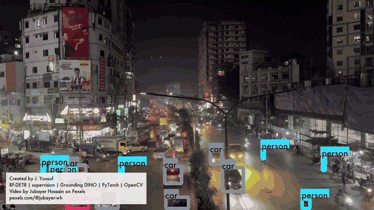
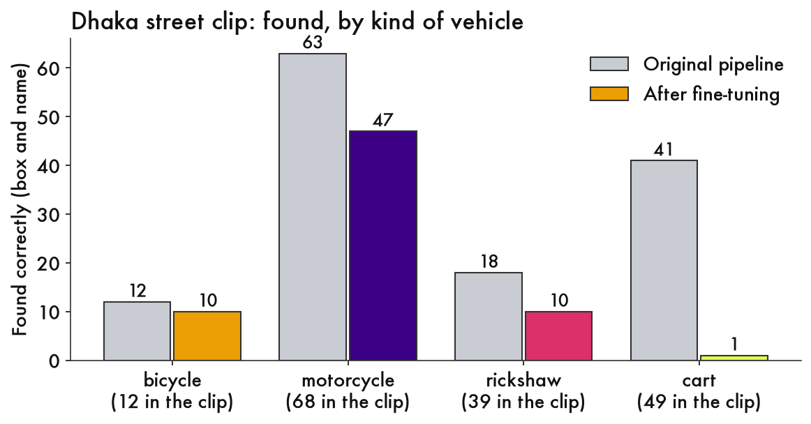
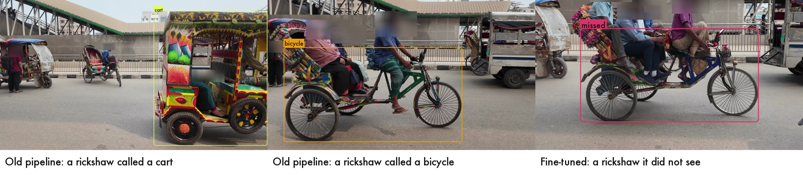
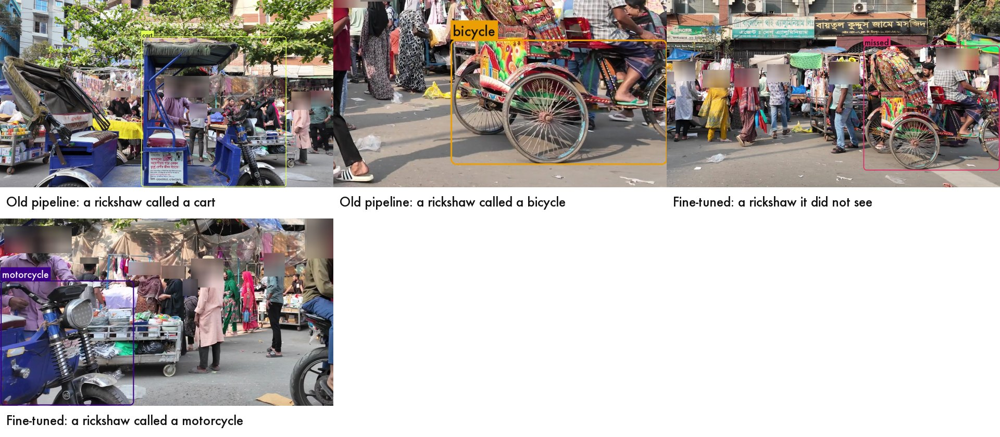

# programmable-dhaka

**Teaching RF-DETR to identify rickshaws in Dhaka street footage, with Roboflow's open source tools.**

*The Dhaka street clip, which RF-DETR never trained on. Blue is a person, pink a rickshaw, purple a motorcycle, amber a bicycle, yellow-green a cart. It finds most of the motorcycles and bicycles, some of the rickshaws, and almost none of the carts. Heads are blurred.*

> **In 30 seconds**
> - **What:** I taught Roboflow's RF-DETR to identify rickshaws, using street video from Dhaka.
> - **Result:** on a street like its training footage it found about 130 of 163 rickshaws, up from 45. On a very different street it did worse than the original setup, mostly because it missed the carts.
> - **Lesson:** fine-tuning works on what it is shown, so show it the messy cases.

## Contents

- [Reasons to try Roboflow's open source tools](#reasons-to-try-roboflows-open-source-tools)
- [Why Dhaka](#why-dhaka)
- [What I used](#what-i-used)
- [The first guess](#the-first-guess)
- [Something I noticed](#something-i-noticed)
- [Does fine-tuning help? It depends on the footage.](#does-fine-tuning-help-it-depends-on-the-footage)
- [What it still gets wrong](#what-it-still-gets-wrong)
- [Product feedback](#product-feedback)
- [More](#more)
- [Footage credits](#footage-credits)

## Reasons to try Roboflow's open source tools

I wanted to understand the product by using it. I found it easy to stand up and onboard, and the speed is good.

- **Plug and play, with intelligent modeling from RF-DETR.** All I needed was videos I downloaded. RF-DETR's pretrained model drew a first set of labels, so I corrected its mistakes instead of drawing every box myself. On the busy Dhaka street I only had to correct 39 of 168 boxes. On the clips that were mostly rickshaws it needed far more correcting, about two thirds.
- **RF-DETR learned an unknown concept from a handful of examples.** It had no word for a rickshaw. I trained it on 141 pictures, but they show only about five different rickshaws, many of them near-copies of each other. About 10 to 15 minutes of training later, on a laptop, it found about 130 of 163 rickshaws in a clip it had never seen, up from 45 with the original setup.
- **Easy to customize and tune.** supervision let me change how vehicles are followed, how steady the boxes are, what gets blurred, and how everything is drawn, with a few settings each.
- **Everything ran on one laptop,** at about 30 milliseconds per picture.

## Why Dhaka

I'm a Bangladeshi-American who has spent time in Dhaka, Bangladesh. I know from experience that there are really unique movement patterns: people with different modalities, really unexpected pathways of travel, non conformity in shapes and colors, culturally vibrant. I wanted to stress test the capabilities of the open source model with something I knew was complex.

## What I used

All open source.

- **[RF-DETR](https://github.com/roboflow/rf-detr)** looks at a picture and draws a box around each thing it recognizes.
- **[supervision](https://github.com/roboflow/supervision)** is Roboflow's library for the pieces around a model: drawing boxes, following a vehicle from frame to frame, smoothing, blurring.
- **[Grounding DINO](https://huggingface.co/IDEA-Research/grounding-dino-tiny)** (IDEA Research, via Hugging Face) finds things from a written description like "a push cart". I used it to draft first labels.
- PyTorch, OpenCV and matplotlib for the rest.

## The first guess

To get started I labeled footage with a first-pass pipeline: RF-DETR plus Grounding DINO. I then corrected it by hand, with one rule: **anything that carries a passenger behind a driver is a rickshaw**, pedal or motorized.

It got things wrong in specific ways. On a night clip it drew 425 "rickshaw" boxes. After my corrections only 58 are rickshaws. Most of the rest were cars.

| Night traffic | Rickshaw | Car | Motorcycle |
|---|---|---|---|
| First guess | 425 | 32 | 0 |
| After my corrections | 58 | 379 | 26 |

*Night traffic. The model trained on this clip, so it is not a test.*

## Something I noticed

I corrected far more of the model's guesses on the clips with less variety than on the varied one.

On the busy Dhaka street, with people, motorcycles, bicycles, carts and rickshaws mixed together, I corrected 23% of the boxes. On the two clips that were mostly rickshaws I corrected 62% and 67%. Night traffic was 86%, almost all of it cars called rickshaws. My reading, which I have not tested: the first-pass tools already handle everyday objects well, so a scene full of everyday objects needs little correcting, and a scene that is mostly the one thing they have no word for needs correcting nearly everywhere.

## Does fine-tuning help? It depends on the footage.

"Fine-tuned" means RF-DETR trained further on my own corrected labels. Each test scores the model on a clip it never trained on, against my corrected labels.

**Test 1: a street like the ones it trained on.** I trained on the Dhaka street and e-rickshaw clips and tested on the rickshaw street clip. The original pipeline found 45 of 163 rickshaws and called 118 of them carts or bicycles. The fine-tuned model found about 130 (I trained it twice: 131 and 135).

**Test 2: a street unlike its training footage.** I trained on the rickshaw street and e-rickshaw clips and tested on the Dhaka street clip. It did worse than the original pipeline (0.44 against 0.81). Adding the night and rainy clips helped, to 0.54, but it stayed below. The biggest gap is carts: the original pipeline found 41 of 49 and the fine-tuned model found 1. My guess: the carts in this market are metal trolleys piled with goods, and the training footage had banana carts and one umbrella cart, so the model had never seen this kind of cart. I have not tested that.

My answer keys started as the original pipeline's own boxes, which flatters it. It still lost on the rickshaw street, so that does not explain Test 1, but it probably explains some of the gap in Test 2. More in [docs/DETAILS.md](docs/DETAILS.md).

**The takeaway.** Fine-tuning worked on what it was shown, on scenes like the ones it was shown. It did not carry over to a scene with kinds of carts it had not seen, and the text-prompt pipeline was better there. A hybrid is the obvious next step, and so is footage that includes the market's carts.

## What it still gets wrong

- Trucks are not a class, so the model guesses, and a truck often comes out as a rickshaw.
- Carts and rickshaws in a crowd are the hardest cases.
- People were not hand-reviewed, so they are left out of every score.

## Product feedback

Things that cost me time, and what I would suggest (rfdetr 1.11.1, supervision 0.30.6). Each one I checked against the library before writing it down.

- **The names and the numbers don't line up.** The model reports each object as a number (person is 1, bicycle is 2, and so on up to 90, with some numbers skipped). The list of 80 names that comes with the library starts at zero. Looking up a name by that number lands on the wrong object, and every label in my first video was off by one: people came out as "bicycle." *Suggestion:* return the names, or a number-to-name dictionary, along with the detections.
- **The error for a removed import points to the wrong place.** `rfdetr.util` was removed in version 1.9. The error says to use `rfdetr.utilities`, but the class names are not there. They are in `rfdetr.assets.coco_classes`. *Suggestion:* name the real location in the message.
- **The model sometimes returns a kind of object that does not exist.** After training on six kinds of objects, it occasionally returned a seventh number. It showed up on 11 boxes in one night clip. I filter it out, and I do not know the cause. *Suggestion:* document it, or do not return it.
- **The deprecation warnings do not say what to use instead.** `RFDETRBase` (deprecated since 1.7.0) and `ByteTrack` (deprecated since supervision 0.28.0) print a warning that names the version they will be removed in, but not a replacement.
- **Training took one extra install and one extra rule on a Mac.** `model.train` fails until you install `rfdetr[train]`. That error is clear and tells you the command. On macOS the training script also crashes unless it is wrapped in `if __name__ == "__main__":`. That is a standard Python rule, but the error you get is a generic one that does not mention it. *Suggestion:* put both in the quickstart.

## More

- [Details and caveats](docs/DETAILS.md): scores, the cutoff table, how the labels were corrected, limits.
- [Reproduce it](docs/REPRODUCE.md): commands and layout.
- [Tips and learnings](docs/LEARNINGS.md): what I'd tell someone trying this.

## Footage credits

All footage is from [Pexels](https://www.pexels.com) under the Pexels License. Everything shown here is altered, and the original videos are not in this repo.

- Dhaka street ("Suhrawardy Udyan TSC") by Faisal Ibne Kalam: [video](https://www.pexels.com/video/suhrawardy-udyan-tsc-26689635/), [profile](https://www.pexels.com/@faisal-ibne-kalam-774996459/)
- e-rickshaws ("Bustling Indian Street with Auto Rickshaws") by md Jahangir alam, filmed in India, not Dhaka: [video](https://www.pexels.com/video/bustling-indian-street-with-auto-rickshaws-38248681/), [profile](https://www.pexels.com/@mdjahangir/)
- Rickshaw street ("Colorful Rickshaws on Bustling Street") by Somogro Bangladesh: [video](https://www.pexels.com/video/colorful-rickshaws-on-bustling-street-36526831/), [profile](https://www.pexels.com/@somogrobangladesh/)
- Night traffic ("Vibrant City Night Traffic Scene") by Jubayer Hossain, tagged Dhaka and Chittagong: [video](https://www.pexels.com/video/vibrant-city-night-traffic-scene-35041521/), [profile](https://www.pexels.com/@jubayer-wh/)
- Rainy walk ("Rainy Day Street Scene in Dhaka, Bangladesh") by Latiful Jawad, labels only: [video](https://www.pexels.com/video/rainy-day-street-scene-in-dhaka-bangladesh-29662763/), [profile](https://www.pexels.com/@latiful-jawad-431220084/)

Created by J. Yousuf.
