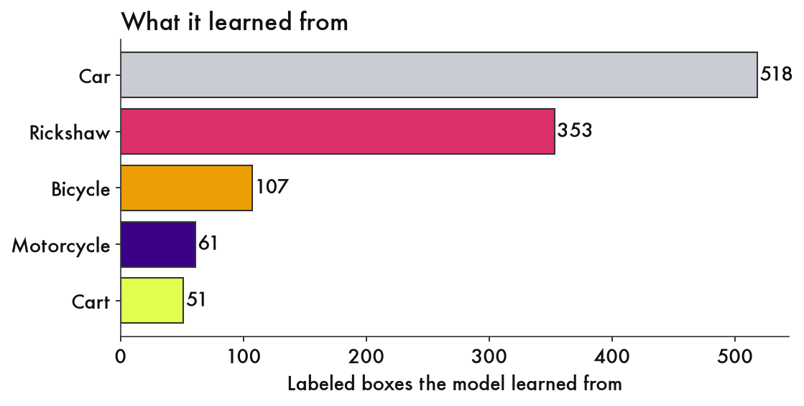

# Details and caveats

The methodology behind the README, for anyone who wants to check it.

## How the tests were scored

Boxes are matched at 50% overlap, by class, vehicles only. People are left out because the person labels were never hand-reviewed: they are the pretrained model's own output. "Overall score" is F1, which runs from 0 to 1 and balances finding things against false alarms. The accuracy printed in training logs is ignored, because its validation pictures overlap the training pictures.

| Test | Trained on | Scored on | Original pipeline | Fine-tuned |
|---|---|---|---|---|
| 1, first run | Dhaka street, e-rickshaws | rickshaw street | 0.29 | 0.79 |
| 1, second run | Dhaka street, e-rickshaws | rickshaw street | 0.29 | 0.80 |
| 2 | rickshaw street, e-rickshaws | Dhaka street | 0.81 | 0.44 |
| 2, more footage | rickshaw street, e-rickshaws, night, rainy walk | Dhaka street | 0.81 | 0.54 |

Rickshaws found on the rickshaw street (of 163): original 45, fine-tuned 131 (first run) and 135 (second run). The scores are in [`eval/`](../eval/).

An earlier version trained on the Dhaka street clip alone and tested on the e-rickshaw clip found rickshaws well (40 of 45, up from 9) but found 0 of 50 banana carts, because the Dhaka street clip has none ([`eval/results_trained_on_clip1_only.json`](../eval/results_trained_on_clip1_only.json)).

## Confidence cutoff on the Dhaka street test

The model only draws a box when it is at least 50% sure. Lowering that finds more and adds false alarms. The headline numbers use 0.5, the same cutoff the videos use. Picking the best cutoff using the test clip would be tuning on the test.

| Cutoff | Overall score | Rickshaws found (of 39) | Carts found (of 49) |
|---|---|---|---|
| 0.5 | 0.54 | 10 | 1 |
| 0.3 | 0.61 | 21 | 7 |
| 0.2 | 0.59 | 34 | 15 |
| Original pipeline | 0.81 | 18 | 41 |

## A caveat that flatters the original pipeline

My answer keys started as the original pipeline's own boxes, which I then corrected. So its box shapes line up with the answer key by construction, while the fine-tuned model has to match them with boxes it draws itself. The original pipeline still lost on the rickshaw street, so this does not explain that result. It probably explains part of the gap on the Dhaka street.

## On the Dhaka street, where the fine-tuned model won

I looked for frames where it found more rickshaws than the original pipeline. There were only 2, so there is no "where it wins" picture for that test.

## What the final model learned from

## How the labels were corrected

The first-pass labels came from the original pipeline: RF-DETR for people, bicycles and motorcycles, plus Grounding DINO with text like "a decorated three-wheeled cycle rickshaw" and "a push cart". The one rule: anything that carries a passenger behind a driver is a rickshaw, pedal or motorized.

For the night and rainy clips I built a small page that runs only on my own machine and groups boxes into vehicles, so I answer once per vehicle instead of once per frame ([`scripts/review_cards.py`](../scripts/review_cards.py)). My first version showed the same vehicle on several cards: 31 of 75 cards continued another card. Fixing the grouping brought the night clip from 75 cards to 51.

The corrections chart counts boxes I relabeled, resized or added. The first three clips are not counted exactly like the last two, where I answered once per vehicle.

## Other limits

- Three short clips per test, one scene each. This shows the loop, and it is not a benchmark.
- The Dhaka street test has the original pipeline's boxes behind its answer key (see above).
- Two reviewed cards (one night, one rainy) were marked "mixed" and left as the model guessed.
- One box in the rickshaw street test is ambiguous between bicycle and rickshaw and is not scored.
- Head blurring uses the model's person detections, so a small face the model missed could still show.
