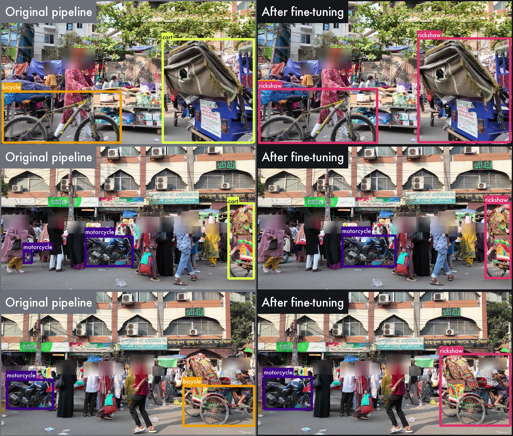
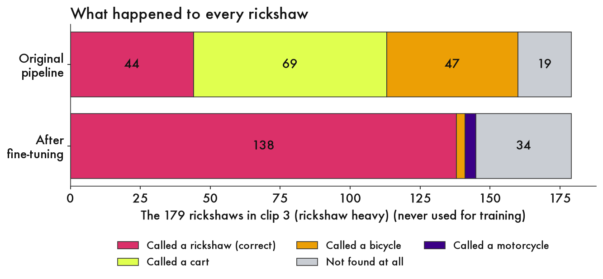
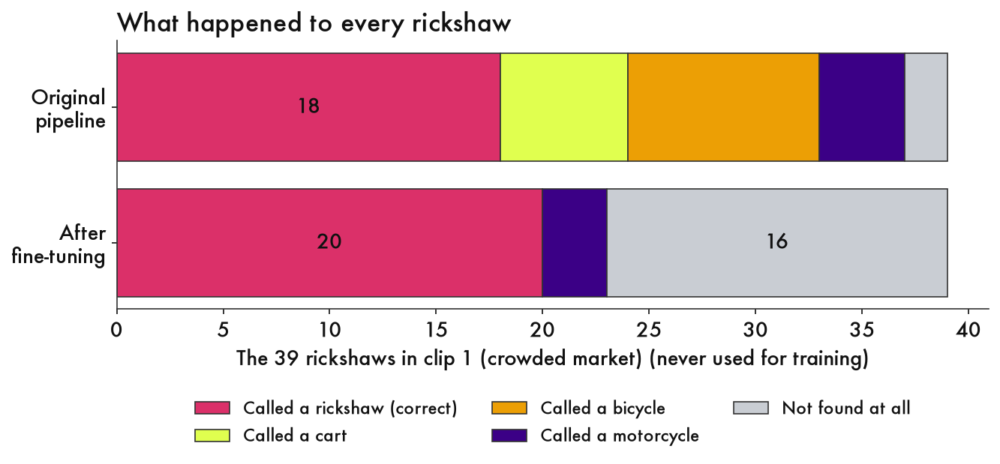
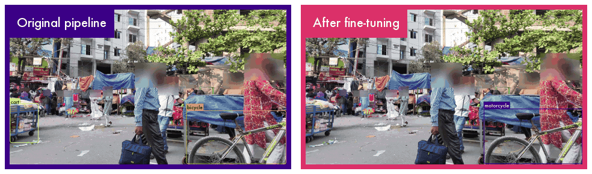
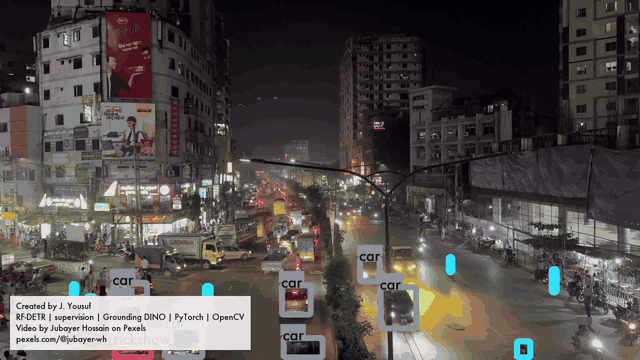

# Details and caveats

The methodology behind the README, for anyone who wants to check it.

The score tables below were rerun in October 2026 against answer keys where I had drawn in the missing boxes (see the [experiment log](EXPERIMENT_LOG.md)). The pictures and GIFs were made with the round 1 models and were not remade. The round 1 scores are still in [`eval/`](../eval/) (`results_*.json`) and at the `round-1` tag.

## How the tests were scored

Boxes are matched at 50% overlap, by class, vehicles only. People are left out because the person labels were never hand-reviewed: they are the pretrained model's own output. "Overall score" is F1, which runs from 0 to 1 and balances finding things against false alarms. The accuracy printed in training logs is ignored, because its validation pictures overlap the training pictures.

| Test | Trained on | Scored on | Original pipeline | Fine-tuned |
|---|---|---|---|---|
| 1 | clips 1 and 2 (Dhaka street, e-rickshaws) | clip 3 (rickshaw street) | 0.27 | 0.76 |
| 2 | clips 2 and 3 (e-rickshaws, rickshaw street) | clip 1 (Dhaka street) | 0.75 | 0.43 |
| 2, more footage | clips 2, 3, 4, 5 (adds night, rainy walk) | clip 1 (Dhaka street) | 0.75 | 0.48 |

On clip 8, the roundabout (328 rickshaws, never trained on), the original pipeline scored 0.28 overall and found 36 rickshaws. A model trained on clips 1 to 4 scored 0.54 and found 168. The best model scored 0.67 and found 160 ([`eval/vs_original_*`](../eval/)).

Round 1 scores, against the earlier answer keys: Test 1 was 0.29 against 0.79 and 0.80 (two runs), Test 2 was 0.81 against 0.44, and 0.81 against 0.54 with more footage.

Rickshaws found on the rickshaw street (of 179): original 44, fine-tuned 138. In round 1, against the earlier key (of 163), the original found 45 and the fine-tuned model 131 and 135 in two runs. The scores are in [`eval/`](../eval/) (`redo_*.json`).

An earlier version trained on the Dhaka street clip alone and tested on the e-rickshaw clip found rickshaws well (40 of 45, up from 9) but found 0 of 50 banana carts, because the Dhaka street clip has none ([`eval/results_trained_on_clip1_only.json`](../eval/results_trained_on_clip1_only.json)).

## How many different rickshaws did the model see?

Test 1 trained on 141 pictures, but pictures are 0.2 seconds apart, so many are near-copies. Linking each rickshaw box to the same vehicle in neighboring pictures, the 84 rickshaw boxes in those pictures come from about 5 separate rickshaws: 2 in the Dhaka street clip and 3 in the e-rickshaw clip. Looser or stricter linking gave between 5 and 7. So it learned the concept from roughly five different vehicles, seen side-on at many positions as they moved across the frame. I counted by linking boxes and did not check each one by eye.

## Confidence cutoff on the Dhaka street test

The model only draws a box when it is at least 50% sure. Lowering that finds more and adds false alarms. The headline numbers use 0.5, the same cutoff the videos use. Picking the best cutoff using the test clip would be tuning on the test.

| Cutoff | Overall score | Rickshaws found (of 39) | Carts found (of 67) |
|---|---|---|---|
| 0.5 | 0.48 | 20 | 1 |
| 0.4 | 0.54 | 26 | 3 |
| 0.3 | 0.59 | 30 | 13 |
| 0.2 | 0.60 | 36 | 24 |
| Original pipeline | 0.75 | 18 | 40 |

## A caveat that favors the original pipeline

My answer keys started as the original pipeline's own boxes, which I then corrected. So its box shapes line up with the answer key by construction, while the fine-tuned model has to match them with boxes it draws itself. The original pipeline still lost on the rickshaw street, so this does not explain that result. It probably explains part of the gap on the Dhaka street.

## Did the fine-tuned model win anywhere on the Dhaka street?

I looked for frames where it found more rickshaws than the original pipeline. With the round 1 models there were only 2, so there was no picture. With the round 2 model (trained on clips 2, 3, 4 and 5) there are enough for three, below. The original pipeline calls the rickshaws carts or bicycles and the fine-tuned model names them. In the top frame the fine-tuned model also calls the bicycle on the left a rickshaw.

## What the final model learned from

## More pictures from the two tests

**Test 1, the rickshaw street.** What happened to every rickshaw, and before and after:

**Test 2, the Dhaka street.** What happened to every rickshaw, and before and after:

## Speed on a Mac

- **What I timed** → my best fine-tuned model (RF-DETR Small, the one scored on the roundabout), one 512 pixel picture at a time, model only → the steps before and after it, like resizing and drawing boxes, are not included
- **The machine** → MacBook Pro, Apple M4 Pro, 24 GB, plugged in → three runs, and the CoreML numbers agreed within 1 ms each time
- **Results**, median milliseconds per picture, lower is better:
  - PyTorch on the CPU → about 71
  - PyTorch on the graphics chip → about 27
  - CoreML 32-bit, CPU and graphics chip → 15
  - CoreML 16-bit, CPU and graphics chip → **13**, the fastest
  - CoreML 16-bit, CPU and Neural Engine → 17
  - CoreML 16-bit, all units → 18
  - CoreML 16-bit, CPU only → 28
  - CoreML 32-bit, CPU only → 45
- **What it shows**
  - CoreML on the graphics chip is about twice as fast as PyTorch on the same chip
  - The Neural Engine was not the fastest here
  - A 32-bit model cannot use the Neural Engine, so "CPU and Neural Engine" matched "CPU only" at 45
- **Same detections?** → on 30 stills (184 detections at 0.5), the 32-bit CoreML model matched all 184 → the 16-bit model matched 183 and drew 1 extra, with confidence scores 0.0157 apart on average
- **Caveats**
  - It is a laptop chip, not a small device next to a camera
  - The Mac was busy at times with iCloud syncing. The first two runs had a load of 20 or more, and PyTorch on the CPU fell from about 80 to 71 ms as it calmed, so the CPU rows are the least reliable
  - RF-DETR's docs mark the CoreML export as experimental, and the tools warned that my PyTorch (2.14) is newer than they have been tested with
  - RF-DETR's docs already publish a similar table for their Nano model on an M3 Pro
- **Rerun it** → `python scripts/benchmark_coreml.py <checkpoint.pth> <folder of stills> speed.json`, on a Mac with `pip install "rfdetr[coreml]"` → my results are in [`eval/speed_mac_m4_pro.json`](../eval/speed_mac_m4_pro.json)

## A video gotcha that was mine, not Roboflow's

A slideshow I made with OpenCV's `mp4v` codec showed as a solid green screen in the player I used. Writing H.264 with `yuv420p` fixed it. The videos made through supervision played fine.

## How the labels were corrected

For the Dhaka street, e-rickshaw and rickshaw street clips, the first-pass labels came from the original pipeline: RF-DETR for people, bicycles and motorcycles, plus Grounding DINO with text like "a decorated three-wheeled cycle rickshaw" and "a push cart". For the night and rainy clips, the first pass came from a model already fine-tuned on the e-rickshaw and rickshaw street clips. The one rule throughout: anything that carries a passenger behind a driver is a rickshaw, pedal or motorized.

For the night and rainy clips I built a small page that runs only on my own machine and groups boxes into vehicles, so I answer once per vehicle instead of once per frame ([`scripts/review_cards.py`](../scripts/review_cards.py)). My first version showed the same vehicle on several cards: 31 of 75 cards continued another card. Fixing the grouping brought the night clip from 75 cards to 51.

The corrections chart counts boxes I relabeled, resized or added. It mixes two kinds of first guess (the original pipeline for the first three clips, a fine-tuned model for night and rainy), so only the first three are a like-for-like comparison. They are also not counted exactly like the last two, where I answered once per vehicle.

## One observation I could not reproduce

With an earlier checkpoint (trained on the rickshaw street and e-rickshaw clips, six classes), the night clip's first guess had 11 boxes with a class number past the last real class (see `labels/night/original_prelabel.coco.json`). The final model returned none: 0 of 921 boxes at a 0.5 cutoff and 0 of 1074 at 0.4. The earlier checkpoint was overwritten, so I cannot test it again. Treat it as unconfirmed. The scripts still skip any out-of-range class number, to be safe.

## Other limits

- Three short clips per test, one scene each. This shows the loop, and it is not a benchmark.
- The Dhaka street test has the original pipeline's boxes behind its answer key (see above).
- Round 1 did not label trucks as a class. Round 2 added a truck class, which did not clearly help rickshaws (see the [experiment log](EXPERIMENT_LOG.md)). The round 1 models and the training run behind the tables above were trained without it.
- Two boxes (a motorcycle in the night clip, a car in the rainy clip) were corrected after the final model was trained, so the model saw the earlier labels for them. Both clips are training-only, so no score is affected.
- One box in the rickshaw street test is ambiguous between bicycle and rickshaw and is not scored.
- Head blurring uses the model's person detections, so a small face the model missed could still show.

## Fewer pictures, same result?

The stills are 0.2 seconds apart, so many are near-copies. For Test 1 I trained on every 4th still, every 2nd, and all of them:

| Pictures used | Rickshaws found (of 179) | False alarms |
|---|---|---|
| 36 (every 4th still) | 117 | 80 |
| 71 (every 2nd) | 136 | 63 |
| 141 (all) | 133 | 42 |

Dropping half the pictures cost nothing here, which fits the near-copies. Dropping three of every four found 16 fewer rickshaws than using all of them and had about twice the false alarms. It is one run per row, and in round 1 training Test 1 twice gave 131 and 135, so differences of a few are inside the noise and a gap of 16 probably is not. I reran this in October 2026 against the corrected answer key, and the round 1 version (124, 128 and 127 of 163) is in `eval/label_budget_clip3_old_key.json`. The test also only tried evenly spaced subsets, not removing pictures by how alike they are. The results are in [`eval/label_budget_clip3.json`](../eval/label_budget_clip3.json), and `scripts/experiment_label_budget.py` reruns it.

## More pictures

**Found, by kind of vehicle, on the Dhaka street:**

**Mistakes on the rickshaw street, and on the Dhaka street:**

**The night clip.** The model I used for the first guess called cars rickshaws: it drew 425 "rickshaw" boxes, and after my corrections 58 boxes in the clip are rickshaws.

| Night traffic | Rickshaw | Car | Motorcycle |
|---|---|---|---|
| First guess | 425 | 32 | 0 |
| After my corrections | 58 | 379 | 26 |

*The model trained on this clip, so this is not a test.*

A later review of this clip's truck and bus boxes found that 4 of the 58 rickshaw boxes were buses or trucks and 18 of the 379 car boxes were trucks or buses. The table above is the round 1 count.